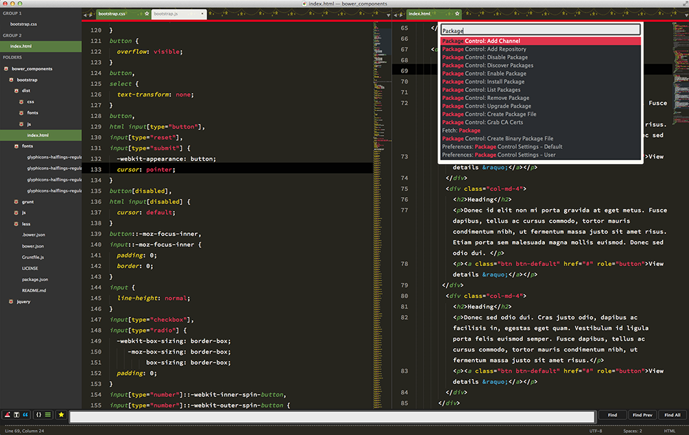

# Merry Christmas Theme
For Sublime Text 2/3
I had the article of the [Sublime Text Advent Calendar 2014](http://www.adventar.org/calendars/407).

## Preview

It's too colorful! So I'm not at usually usable...

## Icon
There is an icon too.

## Installation

 ### Git or Manual Install

    git clone https://github.com/nuttyaika/st-merry-chirstmas

[Download the .zip]()

1. Unzip the files and rename the folder to `MerryChristmas`
2. Copy the folder into `Pakages -> User` directory. You can find using the menu item `Preferences -> Browse Packages...`

## Activate

Modifying your user preferences file.

    {
        "color_scheme": "Packages/User/MerryChristmas/MerryChristmas.tmTheme",
        "theme": "MerryChristmas.sublime-theme"
    }

:santa: Happy Christmas! 

This theme is contributed by [Flatland](https://github.com/thinkpixellab/flatland).
